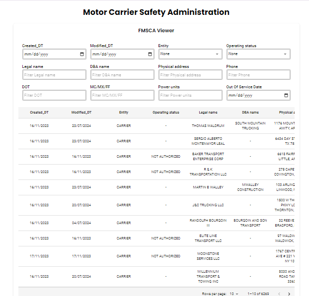

# Project Name

FMSCA Viewer

## Overview

The Federal Motor Carrier Safety Administration (FMCSA) is a U.S. Department of Transportation agency responsible for regulating the trucking industry across the United States. This project provides a centralized platform for viewing and managing a comprehensive dataset related to trucking companies. Built with React.js, MUI, and other modern web technologies. It includes a robust data table with filtering and pagination, a stylish UI with responsive design, and a detailed modal view for data insights.

## Features

- **Data Table**: Displays data with sorting, filtering, and pagination functionalities.
- **Filter Options**: Includes various filters such as text fields, date pickers, and select menus.
- **Detailed View**: Modal view for in-depth data details.
- **Responsive Design**: Adapts to different screen sizes for optimal viewing.

## Technologies Used

- **React.js**: For building the user interface.
- **MUI (Material-UI)**: For UI components and styling.
- **styled-components**: For custom styling of components.
- **TypeScript**: For type safety and better development experience.
- **Framer Motion**: For smooth animations.

## Installation

To set up this project locally, follow these steps:

1. **Clone the Repository**

   ```bash
   git clone https://github.com/asfarwaheed01/Spotter.git
   cd Spotter
   ```

2. **Install Dependencies**

   ```bash
   npm install
   ```

3. **Run the Project**

   ```bash
   npm start
   ```

4. **Open in Browser**

   Navigate to `http://localhost:5173` to view the application.

## Usage

1. **Filtering Data**: Use the filter options at the top of the data table to refine your data view.
2. **Viewing Details**: Click on any row in the data table to open the detailed view modal.
3. **Pagination**: Navigate through pages using the pagination controls at the bottom of the data table.

## OnClick Form

In addition to the data table, the project includes an interactive form that appears upon clicking certain elements. This form allows users to input or modify data, with real-time updates reflected in the table.

## Screenshots



## Customization

To customize the appearance or functionality of the project:

1. **Update Theme**: Modify the `theme.js` file to change the overall look and feel.
2. **Adjust Components**: Edit component files in the `src/components` directory.
3. **Update Data**: Modify the data source as the CSV file is present in the `public` directory.

## License

This project is licensed under the [MIT License](LICENSE).

---

Feel free to add or adjust sections based on your project's specific details! If you need help adding images or any other specifics, let me know!
